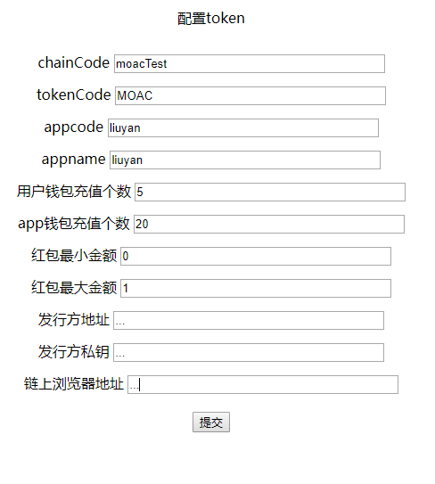
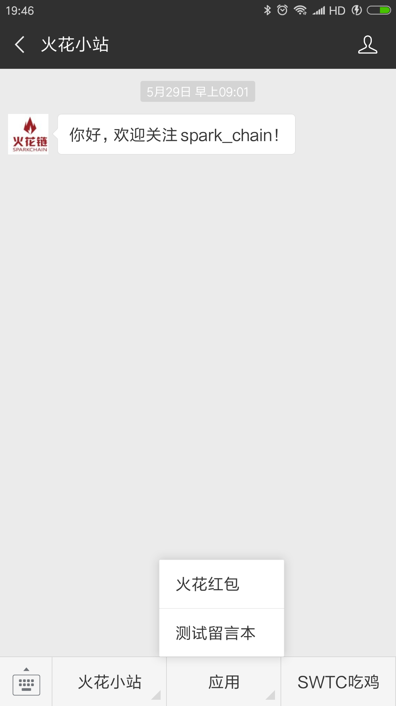

## 微信留言板
 微信留言板是一个利用微信公众号网页，将用户的留言写到区块链上的一个应用， 本应用使用到了火花链区块链接入平台，可以灵活的选择所要写到链。该示例演示了使用MOAC、Jingtum等公链来完成一个信息类的上链工作。包括钱包的创建、转账、文本上链等现实的业务场景，是一个火花Baas接入平台的标准示例。主要流程：
 - 1、先配置相同的参数，定制选择不同的链，不同的Token及相关内容
 - 2、进入微信公众号进行留言。（在进入微信公众号时，会为用户创建钱包，同时应用钱包向用户钱包转Gas费，留言完成，采用文本上链写入公链，同时会发红包面页面。
 - 3、进入查看余额页面
 

### 项目开发使用
  - 进入http://liuyan.sparkchain.cn/reload 页面进行配置。
  
新的appcode,appname会生成一组新的企业钱包，发行方会向该企业钱包充值一定代币，用户初次打开网站会给用户生成一个用户钱包并发给用户一定数量代笔作为手续费，用户提交留言成功后，企业钱包会向用户钱包充值一个红包。

 - 使用微信进入公众号“火花小站”-选择测试留言板-提交留言和填写手机号后，可以得到自己的钱包地址，私钥和余额
 >注：余额由于链上返回时效问题可能不会在转账时做到实时准确。
   
- 项目启动页
微信登录后进入liuyan.sparkchain.cn/init 获取用户code，再调用回调接口liuyan.sparkchain.cn，获取openId,根据openId创建用户钱包（已有钱包则直接跳到钱包页），创建钱包完毕后进入留言页。
  
- 提交留言
提交留言接口liuyan.sparkchain.cn/message/send。用户钱包会向链上提交文本留言（留言需要GAS费），企业钱包会向该用户钱包发一个红包。
- 这些操作完成后，跳到余额页

### 核心类说明
- IndexController类 主程序所有方法都在此类
- ReloadController类 配置页所有方法都在此类

- resources/templates
- message.ftl 留言板页面
- wallet.ftl 钱包页面
- reload.ftl 配置页面

## 学习示例

 - 誓言墙：简单的快速上手的解决方案，https://github.com/moacDapp/oathWall
 - 扫雷小程序：小程序上链哦，可以玩一玩，https://github.com/moacDapp/mineScan
 - moac 流水查询器：学习moac chain3的最佳例子, https://github.com/moacDapp/moac_scan
 - 微信留言板：官方的标准示例，稍稍复杂了一点，https://github.com/sparkChainBaas/wechatMsg
 - Moac、ETH、Jingtum客户端的开发环境，不需要自己搭客户端，搭NodeJS，简单的一行docker命令即可使用，https://github.com/sparkChainBaas/baseDocker
 - Baas平台和官方文档  ：https://github.com/sparkChainBaas/baas

## 官方联系方式

### 官方QQ群

### 官方技术交流论坛
  欢迎大家到<a href="http://sparkda.com/">斯巴达论坛</a>进行提问及交流 

### 官方技术BAAS平台
  欢迎大家到<a href="http://baas.sparkchain.cn/">火花链BaaS平台</a>发现更多好玩的Dapp（目前正开发中）

## 第三方合作伙伴

 - <a href="https://www.jingtum.com/">井通科技</a>,github地址为：https://github.com/swtcpro ，开发者文档地址：http://developer.jingtum.com/  浏览器地址：http://state.jingtum.com

 - <a href="http://www.moac.io/">MOAC</a>,github地址为：ttps://github.com/MOACChain/,开发者文档地址：https://github.com/MOACChain/moac-core/wiki/Commands ,https://github.com/MOACChain/moac-core/wiki/Chain3 ,浏览器地址：http://explorer.moac.io/home

 - 南昌技术开发团队,github地址为:https://github.com/moacDapp/ ,QQ群：805362142

 

wechatMsg is a dapp which put user's message onto the blockchain that through the channel of wechat.
This dapp use sparkchain tools which can switch the bockchain freely to access the blockchain.

# Use
Open http://liuyan.sparkchain.cn/reload to set the configerations。
Create new app wallet by input the appcode,appname. System will generate a new blockchain account for the user who access the dapp for the first time, and the app wallet will send some crypto coins that depends whick blockchain you choose to the new account for gas in the meanwhile. Another payment that from the app wallet to the new account will happen after the user finished the message which have already written onto the blockchain.

 User can see the address and privatekey which belongs to the new account after he finish the message submit.
 PS：Because of the delay of writing data to the blockchian, it will be not able to view the blance immediately and correctly.

## Start page
after oauth by the wechat, access liuyan.sparkchain.cn/init to get the code which generated by the wechat platform，call the callback url liuyan.sparkchain.cn，to get the openId which identify the user, and we use it as the key to create the account. After all these actions dapp will show the message page to the user.

## Message
Call the url liuyan.sparkchain.cn/message/send to submit the message which the user write to the blockchain.（PS: it will costs gas fee），meanwile the app wallet will send a gift payment to the account。Then the browser will jump to the account infomation page. 

- IndexController类 主程序所有方法都在此类
- ReloadController类 配置页所有方法都在此类

- resources/templates
- message.ftl message page
- wallet.ftl account infomation page
- reload.ftl config page

